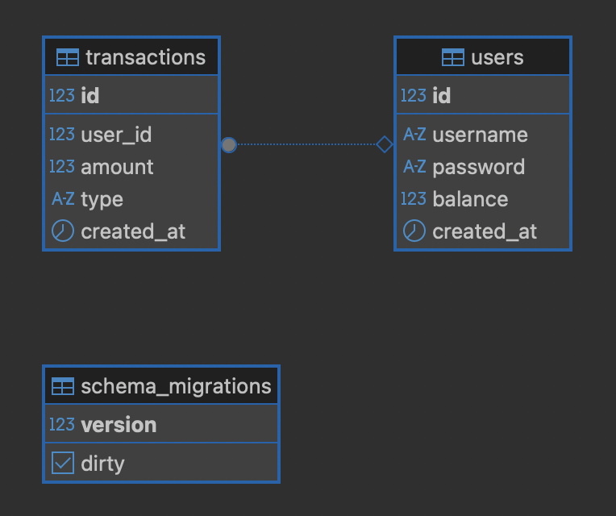

# 🚀 Project Overview

This repository contains a **Go-based backend service** designed with a modular and clean architecture. The project emphasizes separation of concerns, maintainability, and scalability, making it suitable for production-ready distributed systems.

---

## 🏗️ Architecture

The project follows **Clean Architecture principles**:

- **Configurations** → Centralized management of environment variables & runtime settings.
- **Domains** → Core business rules, independent of frameworks/libraries.
- **Internals** → Shared low-level logic (DB, tracing, metrics, helpers).
- **Protocols** → Interface adapters (HTTP controllers, routes, middleware).
- **Migrations** → Version-controlled database schema changes.

This ensures a **layered separation**:
- High-level modules (usecases) do not depend on low-level modules (database).
- Infrastructure is easily replaceable (e.g., switch DB, add gRPC support).

---

## 📑 Database Schema (DDL)

The database schema is managed using SQL migrations under the `migrations/` directory.  
For a quick overview, here’s the **ERD/DDL diagram**:



# 📬 API Documentation (Postman Collection)

You can explore and test the API using the provided **Postman Collection**.  

1. Download the collection file:  
   [`docs/collection.json`](./docs/collection.json)

2. Import it into Postman:
   - Open Postman  
   - Click **Import** → **File**  
   - Select the JSON file  

3. The collection includes:
   - 🔑 Authentication endpoints  
   - 👤 User endpoints  
   - 💸 Transaction endpoints  

---

## ⚙️ Prerequisites

- **Go** v1.21+
- **Docker & Docker Compose**
- **PostgreSQL** (or configured database)
- **Redis** (if used)

---

## 🚦 Getting Started

This project includes a `Makefile` that simplifies common development tasks. Below are the most important commands you can use.

---

### 1️⃣ Clone the repository
```bash
git clone https://github.com/your-repo/your-project.git
cd your-project
```

### 🔧 Dependencies & Vendor
Make sure your Go modules are up to date and vendored:
```bash
make vendor
```

### 🐳 Docker Services
```bash
# Start services in background
make docker/up

# Stop services
make docker/down
```

### 🗄️ Database Migrations
```bash
# Create a new migration file
make run-migrate-create name=add_users_table

# Run all pending migrations
make run-migrate-up

# Rollback the last migration
make run-migrate-down-by-1

# Rollback all migrations
make run-migrate-down-all

# Drop database schema (force) and re-run migrations
make run/migrate
```

### 📦 SQLC (Database Code Generation)
Regenerate type-safe database code from SQL files:
```bash
make sqlc
```

### 🏗️ Build & Run
Build your services and run locally:
```bash
# Build HTTP service
make build-services

# Hot-reload mode for development (using Air)
make watch
```

### ✅ Testing
Run the test suite with race detection:
```bash
make test
```